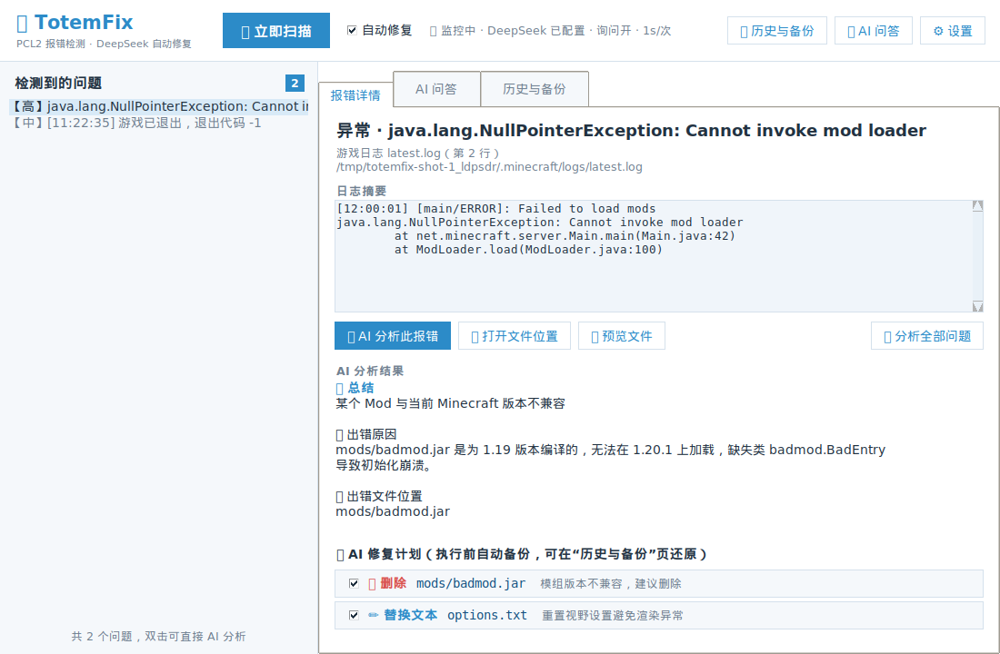
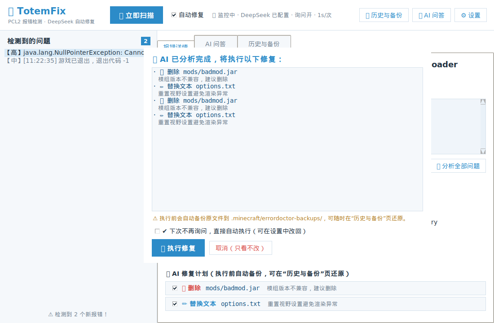
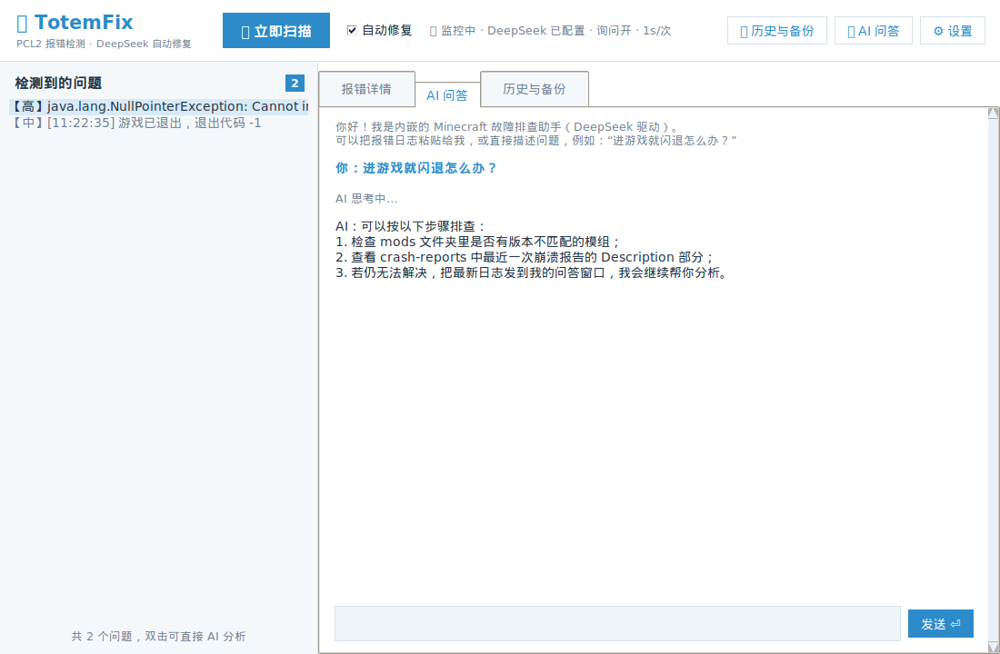
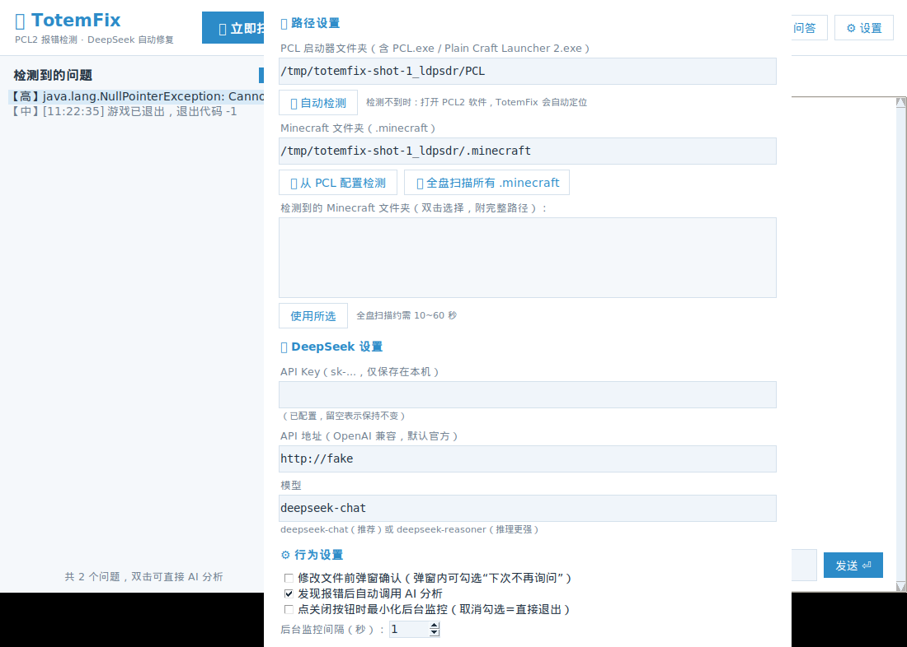

# 🧿 TotemFix v2 —— PCL2 报错检测自动修复工具（DeepSeek 驱动，单文件桌面版）

> 基于社区启动器 **PCL2** 的报错检测处理工具，外接 **DeepSeek** 大模型：
> **一个 exe 放进 PCL2 文件夹，双击即用**。启动即自动扫描 PCL 与 Minecraft 的报错，
> 后台常驻监控，**出现新报错自动弹出分析窗口**，AI 定位**出错原因**与**出错文件位置**并给出**解决办法**，
> 可按设置**全自动执行修复**（修改前弹窗确认，勾选“下次不再询问”后全自动；每次修改前自动备份、可一键还原）。
> 软件内置 **AI 问答窗口**，不再依赖浏览器。

纯 Python 标准库实现，**零第三方依赖**；单文件 exe，免安装。

---

## 📥 下载（Windows 单文件版）

最新版 exe 由 GitHub Actions 在 Windows 环境自动打包发布（附 SHA256 校验文件）：

- **下载页**：<https://github.com/Hy210220/TotemFix/releases/latest>
- **直接下载**：<https://github.com/Hy210220/TotemFix/releases/latest/download/TotemFix.exe>

> 源码仓库：<https://github.com/Hy210220/TotemFix>
> 浏览器/杀软若提示“未知发布者”，属正常现象（未做代码签名），添加信任即可。

---

## ✨ 功能特性

| 功能 | 说明 |
| --- | --- |
| 🚀 单文件免安装 | 一个 `TotemFix.exe` 放进 PCL 文件夹，双击即用，数据自动存到 exe 旁的 `data/` 目录 |
| 🎯 PCL2 自动定位 | 兼容真实 exe 名（`Plain Craft Launcher 2.exe` 等）；**检测到你打开 PCL2 时自动识别运行窗口并定位其文件夹** |
| 📂 多 .minecraft 检测 | 优先读取 PCL 日志与 **PCL 设置中的游戏文件夹**（Setup.ini + 注册表 LaunchFolders），还可**全盘扫描列出所有 .minecraft 附路径供你选择** |
| 🔍 启动自动扫描 | 打开即扫描 PCL 日志（Log1/Log2）、游戏日志 latest.log、崩溃报告 crash-reports、JVM 崩溃日志，并支持版本隔离目录 |
| 👀 后台常驻监控 | 每 3 秒（可调）轮询日志变化；**出现新报错自动弹出窗口**并置顶提醒 |
| 🤖 自动 AI 分析 | 报错后自动调 DeepSeek：一句话总结、根本原因、**出错文件位置**、解决办法步骤、置信度；同一报错不重复触发 |
| 🛠️ 全自动修复 | AI 生成修复计划（删除/重命名/替换文本/写入），按设置自动执行；也可手动勾选执行 |
| ✅ 修改前确认弹窗 | 执行前弹窗列出每项改动，可勾选 **“下次不再询问，直接自动执行”**（设置中可随时改回） |
| 💾 自动备份与还原 | 任何修改前自动备份到 `.minecraft/errordoctor-backups/`，历史与备份页一键还原 |
| 🧱 路径沙箱 | AI 只能操作 `.minecraft` 内相对路径：拒绝盘符、绝对路径、`..` 越界、符号链接、非空目录删除、10MB 以上文件改写 |
| 💬 内嵌 AI 问答 | 软件内对话窗口，可粘贴日志提问或咨询故障排查（与自动修复互不影响） |
| 🖥️ PCL2 风格界面 | 蓝白简约配色，分区清晰：顶栏 / 问题列表 / 详情·问答·历史三个页签 / 状态栏 |
| 🕘 操作历史 | 扫描/分析/修复/还原全部留痕 |
| 🏠 PCL2 主页一键入口（可选） | 附带自定义主页 XAML，在 PCL2 首页放一个按钮直接拉起 exe |

---

## 🚀 快速开始

### 第 1 步：拿到 exe

三种方式任选其一：

- **直接从 GitHub 下载（推荐）**：<https://github.com/Hy210220/TotemFix/releases/latest> 下载 `TotemFix.exe`（官方 Actions 自动打包，附 SHA256 校验）；
- **自己打包**：在 Windows 上装好 Python 3.8+ 后，双击项目里的 `scripts\build.bat`，
  完成后得到 `dist\TotemFix.exe`；
- **源码运行**：装有 Python 3.8+ 时双击 `启动助手.bat` 直接跑源码（无黑色窗口）。

### 第 2 步：放进 PCL 文件夹

把 `TotemFix.exe` 复制到 **PCL 文件夹**（与 `PCL.exe` / `Plain Craft Launcher 2.exe` 同级的那个文件夹），双击打开。

- 程序会自动把「PCL 文件夹」识别为 exe 所在目录；若 exe 放在别处，**打开 PCL2 软件后 TotemFix 会自动识别其运行窗口并定位文件夹**；
- 自动检测 `.minecraft`：优先读 PCL 日志与 **PCL 设置里的游戏文件夹**（Setup.ini + 注册表列表），
  有多个 .minecraft 时可在设置里**点“全盘扫描”列出全部文件夹（附完整路径）自己选一个**。

### 第 3 步：配置 DeepSeek 并开始使用

1. 打开软件 → **⚙️ 设置**：
   - 填 **DeepSeek API Key**（申请教程见下）；
   - 确认 PCL / .minecraft 路径正确（可点自动检测）；
   - 点 **🔌 测试连接** 验证，保存。
2. 保存后即进入全自动状态：
   - 启动时自动扫描，有报错立即弹窗分析；
   - 游戏再次崩溃 → 软件自动弹出窗口 → AI 分析 → 弹窗确认 → 执行修复；
   - 勾选弹窗里的 **“下次不再询问”** 后，再遇到报错就真正全自动修复（可随时在设置中改回）。

---

## 🖥️ 界面速览

| 主界面（报错详情 + AI 分析结果 + 修复计划） | 修改前确认弹窗（可勾选“下次不再询问”） |
| --- | --- |
|  |  |

| 内嵌 AI 问答窗口 | 设置 |
| --- | --- |
|  |  |

---

## 🤖 自动处理流程（一张图看懂）

```
双击 exe 启动
   │ 自动识别 PCL 文件夹（=exe 所在目录）与 .minecraft
   ▼
启动自动扫描 ──有报错──▶ 自动弹窗 + AI 分析（原因 / 出错文件 / 解决办法）
   │                          │
   │◀──后台监控（每3秒）──修复后自动重扫验证
   │
游戏/启动器产生新日志
   ▼
发现“新报错”（同一报错不会重复触发）
   ▼
自动调 DeepSeek 分析
   ▼
生成修复计划？
   ├─ 设置开启“修改前询问”（默认）→ 弹窗列出每项改动 → [执行修复] / [取消]
   │        └─ 勾选“下次不再询问” → 此后全自动执行（设置可改回）
   └─ 设置关闭询问 → 直接执行
   ▼
逐项执行（每项自动备份）→ 弹窗报告修复结果 → 自动重扫验证
```

**手动方式**始终可用：左侧选择问题 → “AI 分析此报错” → 在修复计划里勾选想执行的项 → “执行所选修复”。

---

## 🔑 DeepSeek API Key 申请教程

1. 打开 <https://platform.deepseek.com/> 注册 / 登录；
2. 左侧 **API Keys → 创建 API Key**，复制 `sk-` 开头的密钥（只显示一次）；
3. 进入 **充值** 页面充值少量余额（新用户通常有赠送额度；按量计费，一次分析约 ¥0.01~0.05）；
4. 把密钥粘贴到软件“设置”页保存即可。

> 🔒 密钥只保存在本机 `data/config.json`，只发送给 `api.deepseek.com`，不会上传到其它任何服务器。

---

## 📦 打包（面向没有 Python 的电脑）

在 **Windows** 上：

1. 安装 Python 3.8+（安装时勾选 *Add python.exe to PATH*）；
2. 双击 `scripts\build.bat`（内部执行 `pyinstaller --clean --noconfirm scripts\TotemFix.spec`）；
3. 得到 `dist\TotemFix.exe` —— 单文件、双击即用、无控制台窗口；
4. 把这个 exe 复制进 PCL 文件夹即可（配置数据自动保存在 exe 旁的 `data\` 目录，随 PCL 文件夹整体移动也能保留）。

---

## 🏠 PCL2 主页一键入口（可选）

`pcl2_homepage\TotemFix.xaml` 提供两个按钮（🔍 打开 TotemFix / 🤖 全自动模式启动）：

1. PCL2 → **设置 → 个性化 → 主页 → 选择该 xaml**；或把它 `<local:MyCard>...</local:MyCard>` 的内容复制进你现有主页 xaml 末尾；
2. 按钮用 `{path}` 替换标记自动定位 PCL 文件夹，前提是 `TotemFix.exe` 与 `PCL.exe` 同级。

> 注意：主页按钮只是“入口”，**后台监控需要 exe 保持运行**（可最小化）。

---

## 🧪 开发者

```bash
python3 -m unittest discover -s tests -v    # 45 个单元/集成测试
xvfb-run -a python3 tests/smoke_gui.py      # GUI 全流程冒烟测试（Linux + Xvfb）
xvfb-run -a -s "-screen 0 1280x800x24" python3 tests/shot_gui.py   # 重新生成界面截图
python3 -m errordoctor                      # 源码运行（--autofix / --no-ask / --hidden）
```

测试覆盖：扫描器（GBK 编码、版本隔离、签名去重）、配置检测（PCL exe 名兼容、Setup.ini/注册表解析、多 .minecraft 优先级、全盘扫描剪枝、进程窗口检测）、DeepSeek 客户端（mock：围栏 JSON/401/402/429/坏 JSON/对话）、
修复执行器（备份/还原/路径穿越拒绝）、文件监控器（去抖）、自动流程引擎（新报错识别→分析→修复→去重）、
GUI 全自动流程（启动扫描→弹窗确认→“不再询问”→全自动→问答→设置）。

---

## 📁 目录结构

```
TotemFix/
├── errordoctor/             # Python 核心（标准库 only）
│   ├── __main__.py          # 入口（--autofix / --no-ask / --hidden）
│   ├── config.py            # 配置读写 + PCL/.minecraft 自动检测
│   ├── scanner.py           # 日志/崩溃报告扫描器（签名归一化去重）
│   ├── deepseek.py          # DeepSeek 客户端（结构化分析 + 自由问答）
│   ├── watcher.py           # 文件监控器（轮询 + 去抖）
│   ├── engine.py            # 自动流程引擎（扫描→分析→修复，事件驱动）
│   ├── fixer.py             # 修复执行器（备份/沙箱/还原）
│   ├── history.py           # 操作历史
│   └── gui.py               # 深色 tkinter 界面（详情/AI问答/历史备份/设置/确认弹窗）
├── pcl2_homepage/TotemFix.xaml  # PCL2 自定义主页入口（可选）
├── scripts/
│   ├── build.bat            # 一键打包单文件 exe
│   └── TotemFix.spec     # PyInstaller 配置
├── tests/                   # 单元/集成测试 + GUI 冒烟测试
├── docs/screenshots/        # 界面截图
├── 启动助手.bat             # 源码运行入口（无 exe 时）
└── README.md
```

---

## ❓ 常见问题

**Q：双击 exe 没反应？**
首次启动会做一次自动扫描，若 DeepSeek 未配置会弹引导窗。检查 exe 是否被杀毒软件拦截（PyInstaller 打包的程序偶有误报，添加信任即可）。

**Q：识别不到 PCL 文件夹？**
TotemFix 兼容多种 exe 名（`PCL.exe`、`Plain Craft Launcher 2.exe` 等）与仅有日志的便携版。
仍识别不到时，**打开 PCL2 软件**——TotemFix 会自动识别其运行窗口并定位文件夹；也可在设置里手动填写。

**Q：电脑里有多个 .minecraft，怎么选？**
设置 → Minecraft 文件夹区域点“🔎 从 PCL 配置检测”（优先读取你在 PCL 里设置的游戏文件夹），
或点“💾 全盘扫描所有 .minecraft”，全部候选会**带完整路径**列在列表里，双击即可选用。

**Q：同一报错会反复弹窗吗？**
不会。报错签名做了时间戳归一化，同一报错只触发一次；修复后自动重扫验证，日志里残留的旧报错不会重复触发。

**Q：AI 分析失败提示 401/402/429？**
401 = Key 无效；402 = 余额不足；429 = 请求过频。检查设置里的 Key 与 DeepSeek 账户余额。

**Q：能换模型吗？**
能。设置里把模型改成 `deepseek-reasoner`（推理更强但更慢），或把 API 地址换成任意 OpenAI 兼容接口（含中转站）。

**Q：AI 修复改错了怎么办？**
“历史与备份”页选择对应时间点的备份点“还原”即可，任何修改前都有备份。

**Q：想彻底退出而不是最小化？**
设置里取消勾选“点关闭按钮时最小化后台监控”，或在设置页点“退出程序”。

**Q：会不会把日志/密钥发到别处？**
不会。日志只发送给你配置的 DeepSeek 接口用于分析；密钥只保存在本机；程序不监听任何网络端口。

---

## ⚠️ 免责声明

- 本工具与 PCL2、DeepSeek 官方均无隶属关系；AI 分析结果仅供参考，执行修复前请留意确认弹窗与备份。
- “全自动修复”虽有多重安全护栏与自动备份，仍建议在重要存档/整合包上首次先手动确认修复计划。
- 请遵守 DeepSeek 服务条款，妥善保管自己的 API Key。

## 📄 License

MIT
